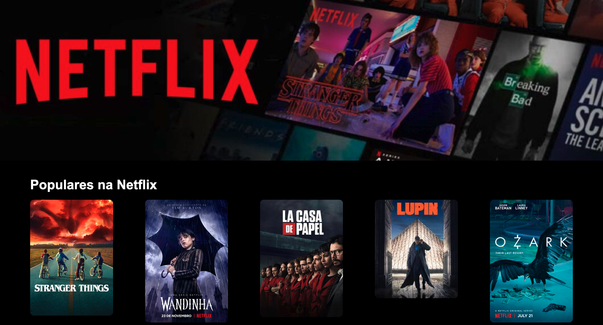
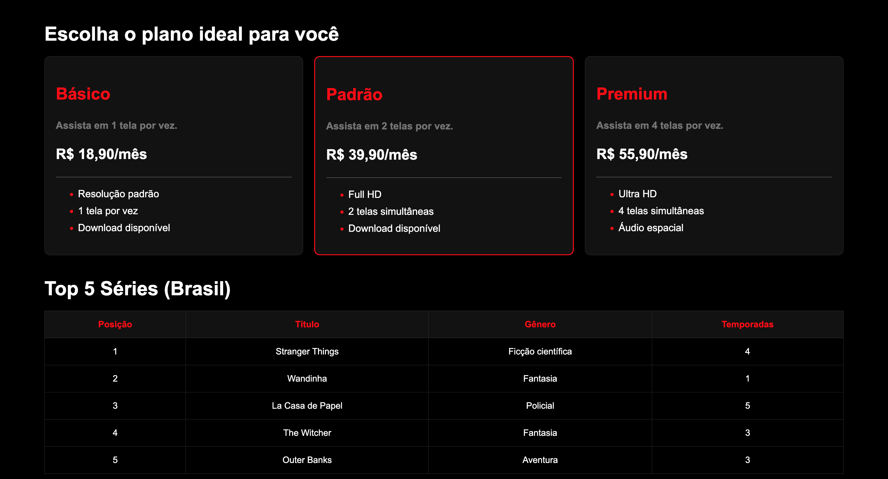

# html-css-basico

## 🌐 Página Web Básica — Projeto Front-end

Este projeto foi desenvolvido como atividade prática para a disciplina de **Desenvolvimento Front-end** do curso integrado de **Desenvolvimento de Sistemas**.

A proposta consiste na criação de uma página web utilizando apenas **HTML5** e **CSS3**, com foco na estruturação de conteúdo, estilização visual e aplicação dos conceitos fundamentais do desenvolvimento web.


# 📌 Tecnologias Utilizadas

- HTML5
- CSS3


# 🎯 Objetivos do Projeto

- Praticar a criação de páginas web utilizando HTML;
- Aplicar estilizações com CSS;
- Trabalhar organização visual e semântica;
- Desenvolver familiaridade com Git e GitHub;
- Entender a estrutura básica de um projeto front-end.


# 📁 Estrutura do Projeto

```bash
📦 projeto-front-end
 ┣ 📜 index.html
 ┣ 📜 style.css
 ┗ 📂 assets
```


# 🚀 Como Executar o Projeto
1️⃣ Clone o repositório: git clone https://github.com/seu-usuario/html-css-basico.git
2️⃣ Acesse a pasta do projeto: cd html-css-basico
3️⃣ Abra o projeto no navegador

Abra o arquivo index.html diretamente no navegador.

 

# 🖼️ Interface do Projeto


